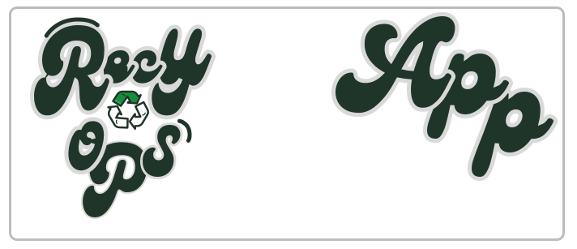

<p align="center">
  
</p>

<p align="center">
  Cliente web para la gestión integral de una operación de reciclaje: ingresos, entregas, inventario, convenios y equipo de trabajo.
</p>

<!-- Núcleo -->
[](https://react.dev/)
[](https://www.typescriptlang.org/)
[](https://vitejs.dev/)
[](https://bun.sh/)

<!-- Ruteo y datos -->
[](https://reactrouter.com/)
[](https://axios-http.com/)

<!-- UI -->
[](https://tailwindcss.com/)
[](https://www.radix-ui.com/)

<!-- Formularios y documentos -->
[](https://react-hook-form.com/)
[](https://zod.dev/)
[](https://github.com/parallax/jsPDF)
[](https://sheetjs.com/)

<!-- Los divertidos de ForTheBadge para cerrar el README -->
[](https://git-scm.com/)
[](https://github.com/)

---

## Qué es RecyOps

RecyOps es una SPA (React + TypeScript) que sirve de back-office para una operación de reciclaje. El backend es un servicio Spring Boot independiente (repo `recyops-backend`); este repositorio contiene únicamente el frontend.

## Funcionalidades

- **Ingresos** — registro de ingresos de material, historial editable y paginado, recibo imprimible
- **Entregas** — gestión de entregas a proveedores/convenios, con historial y estado
- **Inventario** — stock por bodega, ajustes, mermas y configuración de líneas
- **Convenios y proveedores** — administración de convenios comerciales y catálogo de proveedores
- **Bodegas y materiales** — catálogo de bodegas y materiales gestionados
- **Trabajadores y tareas** — alta/edición de trabajadores y asignación de tareas operativas
- **Reportes** — exportación a PDF y Excel
- **Plataforma** — vista de super admin para configuración multi-tenant

## Stack técnico

| Área | Tecnología |
|---|---|
| Framework / build | React 18, TypeScript, Vite 6, Bun |
| Ruteo | React Router 7 |
| HTTP | Axios (instancia única con refresh automático de sesión) |
| UI | Radix UI / shadcn, Tailwind CSS 4, CSS Modules por vista |
| Formularios y validación | React Hook Form + Zod |
| Documentos | jsPDF / jspdf-autotable (PDF), SheetJS (Excel) |

## Inicio rápido

```bash
bun install
bun run dev      # servidor de desarrollo, proxy /api → localhost:8080
bun run build    # build de producción
```

Configura `VITE_API_URL` si el backend no corre en `localhost:8080` (por defecto usa `/api`).

## Estructura del proyecto

```
src/app/
├── http/            clienteApi.ts — instancia Axios única
├── modules/          un folder por dominio de negocio (auth, ingresos, inventario, ...)
├── shared/           layout (topbar, sidebar) y componentes compartidos
└── components/ui/    shadcn/ui — tratar como librería
```

## Documentación

Arquitectura, inventario de módulos, capa de autenticación/API, convención de schemas de validación y el log de decisiones técnicas están en la **[wiki del proyecto](../../wiki)**.
